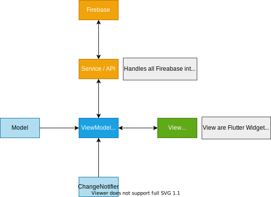

# **Problem Statement**

<p align="justify">
Sviluppare un sistema client-server per la segnalazione di problemi ambientali (roghi, rifiuti , sversamenti , dissesto stradale ) ad enti comunali preposti ad intervenire.
<br>

Ogni Immagine da inviare è accompagnata dai seguenti metadati:
- nome del luogo
- una breve descrizione (max 100 Caratteri)
- tipologia di problema ambientale ( rogo, rifiuto inquinante , sversamento di sostanze tossiche , strada danneggiata )
- un'immagine
- la posizione geografica
- data e ora della segnalazione
- urgenza di intervento ( da 1 =poco urgente a 10 =critica )
- stato ( pendente o risolta )

<p align="justify">
L'applicazione mobile (da creare con l'Android SDK o il framework Flutter) deve permettere le operazioni essenziali (registrazione, login, invio segnalazione, elenco segnalazioni).
Per mostrare le segnalazioni deve essere utilizzata una mappa che mostra le immagini con la relativa gravità, il tempo dalla creazione e lo stato (risolta o pendente).
L'app prevede due tipi di utenti: l'utente generico ed il dipendente comunale.
L'utente generico può solo creare segnalazioni mentre il dipendente comunale può solo etichettare segnalazione esistenti come risolte.
<br>
<br>
Il servizio di backend implementa un'API rest e può essere realizzato utilizzando Spring, Vert.X o Firebase a scelta. Le funzionalità sono le seguenti:

- Registrazione di un nuovo utente
- Login
- Upload di una immagine con i relativi metadati di segnalazione (previo login)
- Modifica stato di una segnalazione (solo dipendente comunale)

<br>

# **Indice**

- [Applicazione Mobile](#Applicazione-Mobile)

  - [Architettura dell'app mobile](#ArchitetturaMobile)
  - [Componenti dichiarati nel manifest](#ComponentiManifest)
  - [Modello Navigazionale](#ModelloNavigazionale)
  - [Viste](#Viste)
  - [Struttura delle Viste](#StrutturaViste)
  - [Gestione persistenza e servizi del sistema](#GestionePersistenzaServiziSistema)

- [Servizi Backend](#Servizi-Backend)

  - [Architettura backend](#ArchitetturaBackend)
  - [API REST](#APIREST)
  - [Autenticazione ed Autorizzazione](#AutenticazioneAutorizzazione)
  - [Persistenza](#Persistenza)


# **Applicazione Mobile**

Prima di passare alla documentazione dell'app ho analizzato attentamente il problem statement, e durante la progettazione sono state fatte delle conclusioni:
- Gli unici utenti che si possono registrare sull'app sono utenti con ruolo **utente**. Gli utenti **admin** devono essere pre-registrati sul database.
- I dati della segnalazione vengono recuperati direttamente dalla posizione geografica (ad esempio il nome del posto).
- L'applicazione funziona solo con una connessione ad Internet.

<br>

## **Architettura dell'app mobile** <a name="ArchitetturaMobile"></a>

L'app è basata sul pattern architetturale <b>MVVM (Model View ViewModel)</b>. La ViewModel è un modello che la vista osserva e ogni volta che un modello cambia, la vista si aggiornerà.<br> 

<div align="center">
<br>
 
</div>

Nello specifico:
<div align="justify">

- <b>Dipendenze</b> utilizzate ***provider*** e ***firebase*** (come servizio web).

- <b>Model</b> riferito o al modello di una segnalazione (ModelImage) o al modello utente (ModelUser).

- <b>View</b> tutte le viste con cui l'utente può interagire e verranno aggiornate in base alla ViewModel.

- <b>Service / API</b> sono i servizi che permettono di manipolare i dati su Firebase (Auth, Storage, Realtime).

- <b>ViewModel</b> contiene la logica UI. Una classe che estende il **ChangeNotifier** che aggiorna le viste (notifica) se ci sono modifiche alla ViewModel.

<div align="center">
<br>
 
</div>
<br>

 </img>

L'applicazione è composta da diversi package:

 - **Model**, nel quale sono presenti i data type del dominio dell'applicazione. _ModelUser_ (descrive un utente dell'applicazione caratterizzato da email, username e role) e _ModelImage_ (descrive una segnalazione caratterizzata da tutti i suoi metadati).

 - **Service**, sono presenti i diversi servizi utilizzati dall'applicazione:
    - Tutti i servizi _Firebase_ (Auth, Storage, Realtime)
    - _Position_ servizio che gestisce i servizi di geolocalizzazione del sistema e comprende anche un metodo di geo-coding inverso
    - _Multiple Provider_ che contiene diversi dati che fornisce ai vari Wigdet (Auth, dbStorage, dbRealtime)

- **View**, contiene tutte le possibili viste della UI dell'applicazione
- **ViewModel**, è presente la ViewModel della segnalazione per rispettare il pattern MVVM (utilizzato per prelevare informazioni dal database e renderizzarli in una determinata UI)
- **Wigdet**, sono presenti wigdet utilizzati nelle View.

<br clear="right"/>

<br>


## **Componenti dichiarati nel manifest** <a name="ComponentiManifest"></a>

Il file manifest è un file XML che contiene informazioni dettagliate riguardo l'applicazione, in particolare definisce:

- Il nome del package
- Il codice della versione
- Il nome della version
- La versione del SDK minima per l'utilizzo dell'applicazione (minSdkVersion)
- L'immagine che rappresenta l'applicazione sul dispositivo (icon)
- Il nome dell'applicazione (label)
- Il nome delle activity presenti nell'applicazione

<br>
Nel manifest ('pubspec.yaml') sono stati aggiunti alcuni plugin per:
<br>
<div align="center">

| Utility | Plugin | Version | Scope  |
|:---------|:--------|---------:|:--------|
| [Alert](https://pub.dev/packages/fluttertoast)   | fluttertoast   | ^8.0.8    | Plug-in per Flutter che supporta due tipo di messaggi di toast (BuildContext e NoBuildContext) |
| [Google Maps](https://pub.dev/packages/google_maps_flutter)     | google_maps_flutter  | ^2.0.11  | Plugin che fornisce a Flutter un Google Maps Widget.  |
| [Geo Locator](https://pub.dev/packages/geolocator)   | geolocator  | ^7.7.0     |  Un plug-in di geolocalizzazione Flutter che fornisce un facile accesso ai servizi di localizzazione specifici della piattaforma  |
| [Geo Coding](https://pub.dev/packages/geocoding)   | geocoding  | ^2.0.1     |  Un plug-in di geocodifica Flutter che fornisce funzionalità di geocodifica semplice e geocodifica inversa  |
| [Image Picker](https://pub.dev/packages/image_picker)   | image_picker  | ^0.8.4+2     | Un plug-in Flutter per iOS e Android per selezionare immagini dalla libreria di immagini e scattare nuove foto con la fotocamera   |
| [Firebase Autenticazione](https://pub.dev/packages/firebase_auth)     | firebase_auth   | ^3.1.3      | Plugin usato per utilizzare l'API di autenticazione Firebase     |
| [Firebase Database](https://pub.dev/packages/firebase_database)   | firebase_database  | ^8.0.0     | Plugin usato per utilizzare l'API del Realtime Database   |
| [Firebase Storage](https://pub.dev/packages/firebase_storage)   | firebase_storage  | ^10.0.5     |  Plugin usato per utilizzare l'API di Cloud Storage Firebase  |
| [Loading Widget](https://pub.dev/packages/flutter_spinkit)   | flutter_spinkit  | ^5.1.0     | Una collezione di loading indicators animated con flutter   |
| [Provider](https://pub.dev/packages/provider)   | provider  | ^6.0.1     |  Serve per rendere più semplice l'utilizzo dei InheritedWidget  |
| [Internet Connection Checker](https://pub.dev/packages/internet_connection_checker)   | internet_connection_checker  | ^0.0.1+3     | Libreria pura di Dart Utility che verifica la presenza di connessione Internet aprendo un socket ad una lista di indirizzi specificati |

</div>

<br>

## **Modello Navigazionale** <a name="ModelloNavigazionale"></a>


<div align="center">
<br>
 
</div>
<br>
<br>

## **Viste** <a name="Viste"></a>
Le viste dell'app sono:
<br>

## 📱 Access Page
<p align="center">
<br>
  
</p>
<br>

## 📱 Home Page User
<p align="center">
<br>
  
</p>
<br>

## 📱 Home Page Admin
<p align="center">
<br>
  
</p>
<br>

## 📱 Support 
<p align="center">
<br>
 

## **Struttura delle Viste** <a name="StrutturaViste"></a>
L'app è strutturata nel seguente modo:

<p align="center">
<br>
 
</p>


Funzionamento dell'app prevede l'utilizzo di diversi **provider** che forniscono dati ai vari widget. 
- Un **MultipleProvider** (come radice del tree widget) che contiene diversi dati che fornisce ai vari Wigdet, come:

  > ***Auth*** = utilizzato per l'autenticazione
  >
  > ***dbStorage*** = utilizzato per effettuare operazioni CRUD su Firebase Storage
  >
  > ***dbRealtime*** = utilizzato per effettuare operazioni CRUD su Firebase Realtime

  Per consentire ciò eredita [InheretedWidget](https://api.flutter.dev/flutter/widgets/InheritedWidget-class.html). InheritedWidget è un semplice widget che non fa altro che contenere dati.

 - **StreamProvider**, utilizzato per controllare lo stato della connessione del dispositivo che avviene effettuato diversi "ping" su diversi host (ad esempio, Google, CloudFlare, ...).

 - **ChangeNotifierProvider**, utilizzato per prelevare i dati relativi alle segnalazioni dal Firebase Realtime e fornirli alla View (che ha come padre ChangeNotifierProvider).

<br>

## **Gestione persistenza e servizi del sistema** <a name="GestionePersistenzaServiziSistema"></a>
L'applicazione non utilizza lo storage interno del dispositivo, vengono utilizzati i servizi di Firebase Realtime e Storage per scrivere e leggere i dati. <br>
La memoria del dispositivo viene utilizzata solo per salvare nella cache:
- Le immagini relative alle segnalazioni (alla chiusura dell'app vengono rimosse)
- Token di autenticazione dell'utente (riutilizzabile per altre operazioni sul db)

Del sistema sono stati utilizzati i servizi:
- **Foto e Galleria:** resi disponibili all'uso attraverso il plugin di Flutter _image_picker_; all'interno del quale vengono definiti diversi metodi per utilizzare i servizi di Camera e Galley (utilizzata solo dall'utente).
- **Positione:** reso disponibile all'uso attraverso il plugin di Flutter _location_; consente l'accesso alla posizione corrente dell'utente utilizzando il GPS del dispositivo (condizione necessaria per l'utente e non per l'admin).
- **Rete:** reso disponibile all'uso attraverso il plugin di Flutter; verifica lo stato della connessione attraverso diversi ping test su indirizzi specifici. Se il ping fallisce significa che il dispositivo è offline.
<br>
<br>

# **Servizi Backend**

## **Architettura backend** <a name="ArchitetturaBackend"></a>
L'architettura Backend è stata realizzata mediate Firebase che offre numerosi servizi. <br> I servizi usati per la realizzazione del backend sono:
<div align="justify">

- <b>Authentication</b>, utilizzato per la creazione del sistema di registrazione e login tramite email e password (ma Firebase prevede anche l'utilizzo di servizi come Google, Facebook o Twitter per l'autenticazione).


- <b>Realtime Database</b>, è un database ospitato nel cloud. I dati vengono archiviati come JSON e sincronizzati in tempo reale con ogni utente client connesso. È stato utilizzato per poter conservare i dati di ogni utente e i dati di ogni segnalazione.


- <b>Storage</b>, è un servizio di archiviazione di contenuti generati dagli utenti, come foto e video. È stato utilizzato per archiviare le foto (file) relative alle segnalazioni.

<br>

## **API REST** <a name="APIREST"></a>

<div align="justify">
Firebase mette a disposizione diversi endpoint per consentire operazioni di lettura e scrittura sul database ma anche di autenticazione.
</div>
<br>

  - [API REST Autenticazione Firebase](#APIRESTAutenticazioneFirebase)
  - [API REST Database Firebase (UsersData e ImagesData)](#APIRESTDatabaseFirebase)
  - [API REST Storage Firebase](#APIRESTStorageFirebase)

<br>

## **API REST Autenticazione Firebase** <a name="APIRESTAutenticazioneFirebase"></a>

<div align="justify">
In questo documento, API_KEY si riferisce al Web API Key, che può essere ottenuto sul progetto di impostazioni pagina nella console di amministrazione di firebase.

<br>
<br>

### **Iscrizione con e-mail/password**
È possibile creare un nuovo utente specificando e-mail e la password mediante l'emissione di un **HTTP POST** richiesta al Auth ***signupNewUser*** endpoint.

>**Method:** `POST`
>
>**Content-Type:** `Application/json`
>
>**Endpoint:** `https://identitytoolkit.googleapis.com/v1/accounts:signUp?key=[API_KEY]`

>**Request Body Payload:**

| Name  | Type  | Description |
|-------|-------|-------------|
| email | string  | L'e-mail che l'utente deve creare.        |
| password   | string | La password che l'utente deve creare.      |
| returnSecureToken   | boolean  | Se restituire o meno un ID e aggiorna il token. Dovrebbe essere sempre vero.          |

<br>

> **Response Payload:**

Una richiesta di successo è indicata da un <span style="color:green">**200 OK**</span> codice di stato HTTP. La risposta contiene il ID Token Firebase e il token di aggiornamento associati al nuovo account.


| Name  | Type  | Description |
|-------|-------|-------------|
| idToken | string  | Un token ID di Firebase Auth per l'utente appena creato.        |
| email   | string | L'e-mail dell'utente appena creato.      |
| refreshToken   | string  | Un token di aggiornamento di Firebase Auth per l'utente appena creato.          |
| expiresIn | string  | Durata in secondi del token ID.        |
| localId | string  | L'uid dell'utente appena creato.        |

<br>

>  **Error Response Payload:**

- <span style="color:darkred"><b>EMAIL_EXISTS</b></span>: l'indirizzo email è già utilizzato da un altro account.
- <span style="color:darkred"><b>OPERATION_NOT_ALLOWED</b></span>: l'accesso con password è disabilitato per questo progetto.
- <span style="color:darkred"><b>TOO_MANY_ATTEMPTS_TRY_LATER</b></span>: abbiamo bloccato tutte le richieste da questo dispositivo a causa di attività insolite. Riprovare più tardi.

<br>

> **Sample:**

        curl 'https://identitytoolkit.googleapis.com/v1/accounts:signUp?key=[API_KEY]' 
        -H 'Content-Type: application/json' 
        --data-binary '{
            "email": "[user@example.com]",
            "password": "[password]",
            "returnSecureToken": true
        }' 
<br>

### **Accedere con e-mail/password**
È possibile accedere ad un utente specificando e-mail e password mediante l'emissione di un **HTTP POST** richiesta al Auth ***verifyPassword*** endpoint.

> **Method:** `POST`
>
> **Content-Type:** `Application/json`
>
> **Endpoint:** `https://identitytoolkit.googleapis.com/v1/accounts:signInWithPassword?key=[API-KEY]`
  
>  **Request Body Payload:**


| Name  | Type  | Description |
|-------|-------|-------------|
| email | string  | L'e-mail con cui l'utente sta effettuando l'accesso.        |
| password   | string | La password dell'utente.      |
| returnSecureToken   | boolean  | Se restituire o meno un ID e aggiorna il token. Dovrebbe essere sempre vero.          |

<br> 

>  **Response Payload:**

Una richiesta di successo è indicata da un <span style="color:green">**200 OK**</span> codice di stato HTTP. La risposta contiene il ID Token Firebase e il token di aggiornamento associati all'account email/password esistente.

       
| Name  | Type  | Description |
|-------|-------|-------------|
| idToken | string  | Un token ID di Firebase Auth per l'utente autenticato.        |
| email   | string | L'e-mail dell'utente autenticato.      |
| refreshToken   | string  | Un token di aggiornamento di Firebase Auth per l'utente autenticato.          |
| expiresIn | string  | Durata in secondi del token ID.        |
| localId | string  | L'uid dell'utente autenticato.        |
| registered | boolean  | Se l'email è di un account esistente.        |

<br>

> **Error Response Payload:**

 - <span style="color:darkred"><b>EMAIL_NOT_FOUND</b></span>: l'indirizzo email non corrisponde a nessun utente registrato.
 - <span style="color:darkred"><b>INVALID_PASSWORD</b></span>: la password non è valida o l'utente non dispone di una password.
 - <span style="color:darkred"><b>USER_DISABLED</b></span>: l'utente è stato disabilitato da un amministratore. 
    
<br>

> **Sample:**

        curl 'https://identitytoolkit.googleapis.com/v1/accounts:signInWithPassword?key=[API_KEY]' 
        -H 'Content-Type: application/json' 
        --data-binary '{
            "email": "[user@example.com]",
            "password": "[password]",
            "returnSecureToken": true
        }' 

<br>

### **Ottieni dati utente**
È possibile ottenere i dati di un utente mediante l'emissione di un HTTP POST richiesta al Auth ***getAccountInfo*** endpoint.

> **Method:** `POST`
>
> **Content-Type:** `Application/json`
>
> **Endpoint:** `https://identitytoolkit.googleapis.com/v1/accounts:lookup?key=[API-KEY]`
  
>  **Request Body Payload:**


| Name  | Type  | Description |
|-------|-------|-------------|
| idToken | string  | ID Token Firebase dell'account.      |

<br>

>  **Response Payload:**

Una richiesta di successo è indicata da un <span style="color:green">**200 OK**</span> codice di stato HTTP. La risposta conterrà tutte le informazioni sull'utente associate all'account.

     

| Name  | Type  | Description |
|-------|-------|-------------|
| users | List of JSON objects  |  l'account associato all'ID Token Firebase specificato.      |

<br>

>  **Error Response Payload:**

- <span style="color:darkred"><b>INVALID_ID_TOKEN</b></span>: le credenziali dell'utente non sono più valide. L'utente deve eseguire nuovamente l'accesso.
- <span style="color:darkred"><b>USER_NOT_FOUND</b></span>: nessun utente corrisponde a questo identificatore. Utente potrebbe essere stato eliminato.
    
<br>

> **Sample:**

        curl 'https://identitytoolkit.googleapis.com/v1/accounts:lookup?key=[API_KEY]' 
        -H 'Content-Type: application/json' 
        --data-binary '{
            "idToken": "[FIREBASE_ID_TOKEN]"
        }' 

<br>

### **Invio e-mail di rest password**
È possibile inviare una e-mail di reimpostazione password mediante l'emissione di un HTTP POST richiesta al Auth ***getOobConfirmationCode*** endpoint.

> **Method:** `POST`
>
> **Content-Type:** `Application/json `
>
> **Endpoint:** `https://identitytoolkit.googleapis.com/v1/accounts:sendOobCode?key=[API_KEY] `
  
>  **Request Body Payload:**


| Name  | Type  | Description |
|-------|-------|-------------|
| requestType | string  | Il tipo di codice OOB da restituire. Dovrebbe essere "PASSWORD_RESET" per la reimpostazione della password.       |
| email | string  | Indirizzo e-mail dell'utente.       |

<br>

> **Response Payload:**

Una richiesta di successo è indicata da un <span style="color:green">**200 OK**</span> codice di stato HTTP.
 

| Name  | Type  | Description |
|-------|-------|-------------|
| email | string  |  Indirizzo e-mail dell'utente.      |

<br>

>  **Error Response Payload:**

- <span style="color:darkred"><b>EMAIL_NOT_FOUND</b></span>: l'indirizzo email non corrisponde a nessun utente registrato.

<br>

> **Sample:**

        curl 'https://identitytoolkit.googleapis.com/v1/accounts:sendOobCode?key=[API_KEY]' 
        -H 'Content-Type: application/json' 
        --data-binary '{
            "requestType": "PASSWORD_RESET",
            "email": "[user@example.com]"
        }' 

<br>

### **Conferma reset Password**
È possibile applicare un reset password mediante l'emissione di un HTTP POST richiesta al Auth ***resetPassword*** endpoint.

> **Method:** `POST`
>
> **Content-Type:** `Application/json`
>
> **Endpoint:** `https://identitytoolkit.googleapis.com/v1/accounts:resetPassword?key=[API_KEY]`
  
>  **Request Body Payload:**
    
| Name  | Type  | Description |
|-------|-------|-------------|
| oobCodice | string  | Il codice azione e-mail inviato all'e-mail dell'utente per reimpostare la password.       |
| newPassword | string  | La nuova password dell'utente.       |

<br>

>  **Response Payload:**

Una richiesta di successo è indicata da un <span style="color:green">**200 OK**</span> codice di stato HTTP.
 

| Name  | Type  | Description |
|-------|-------|-------------|
| email | string  |  Indirizzo e-mail dell'utente.      |
| requestType | string  |  Tipo di codice azione e-mail. Dovrebbe essere "PASSWORD_RESET".      |

<br>

> **Error Response Payload:**

- <span style="color:darkred"><b>OPERATION_NOT_ALLOWED</b></span>: l'accesso con password è disabilitato per questo progetto.
- <span style="color:darkred"><b>EXPIRED_OOB_CODE</b></span>: il codice azione è scaduto.
- <span style="color:darkred"><b>INVALID_OOB_CODE</b></span>: il codice azione non è valido. Ciò può accadere se il codice non è corretto, è scaduto o è già stato utilizzato.
- <span style="color:darkred"><b>USER_DISABLED</b></span>: l'utente è stato disabilitato da un amministratore.

<br>

> **Sample:**

        curl 'https://identitytoolkit.googleapis.com/v1/accounts:resetPassword?key=[API_KEY]' 
        -H 'Content-Type: application/json' 
        --data-binary '{
            "oobCode":"[PASSWORD_RESET_CODE]",
            "newPassword":"[NEW_PASSWORD]"
        }'     

<br>

### **Cambia Password**
È possibile modificare la password di un utente con l'emissione di un HTTP POST richiesta al Auth ***setAccountInfo*** endpoint.

> **Method:** `POST`
>
> **Content-Type:** `Application/json`
>
> **Endpoint:** `https://identitytoolkit.googleapis.com/v1/accounts:update?key=[API_KEY]`
  
>  **Request Body Payload:**


| Name  | Type  | Description |
|-------|-------|-------------|
| idToken | string  | ID Token Firebase dell'account.       |
| newPassword | string  | La nuova password dell'utente.       |
| returnSecureToken | boolean  | Se restituire o meno un ID e aggiorna il token. Dovrebbe essere sempre vero.       |

<br>

>  **Response Payload:**

Una richiesta di successo è indicata da un <span style="color:green">**200 OK**</span> codice di stato HTTP. La risposta contiene il nuovo token ID Firebase e il token di aggiornamento associati all'utente.


| Name  | Type  | Description |
|-------|-------|-------------|
| localId | string  |  L'uid dell'utente corrente.      |
| email | string  |  Indirizzo e-mail dell'utente.      |
| passwordHash | string  |  Versione hash della password.      |
| providerUserInfo | List of JSON objects  |  Elenco di tutti gli oggetti provider collegati che contengono "providerId" e "federatedId".      |
| idToken | string  |  Nuovo token ID Firebase Auth per l'utente.      |
| refreshToken | string  |   Un token di aggiornamento di Firebase Auth.     |
| expiresIn | string  |  Durata in secondi del token ID.      |

<br>

> **Error Response Payload:**

- <span style="color:darkred"><b>INVALID_ID_TOKEN</b></span>: le credenziali dell'utente non sono più valide. L'utente deve eseguire nuovamente l'accesso.
- <span style="color:darkred"><b>WEAK_PASSWORD</b></span>: la password deve essere lunga almeno 6 caratteri.


<br>

> **Sample:**

        curl 'https://identitytoolkit.googleapis.com/v1/accounts:update?key=[API_KEY]' 
        -H 'Content-Type: application/json' 
        --data-binary '{
            "idToken": "[FIREBASE_ID_TOKEN]",
            "password":"[NEW_PASSWORD]",
            returnSecureToken":true
        }'      

<br>

### **Elimina Account**
È possibile eliminare un utente corrente mediante l'emissione di un HTTP POST richiesta al Auth ***deleteAccount*** endpoint.
> **Method:** `POST`
>
> **Content-Type:** `Application/json`
>
> **Endpoint:** `https://identitytoolkit.googleapis.com/v1/accounts:delete?key=[API_KEY]`
  
>  **Request Body Payload:**
    
| Name  | Type  | Description |
|-------|-------|-------------|
| idToken | string  | ID Token Firebase dell'account da eliminare.       |

<br>

>  **Response Payload:**

Una richiesta di successo è indicata da un <span style="color:green">**200 OK**</span> codice di stato HTTP.

<br>

>  **Error Response Payload:**

- <span style="color:darkred"><b>INVALID_ID_TOKEN</b></span>: le credenziali dell'utente non sono più valide. L'utente deve eseguire nuovamente l'accesso.
- <span style="color:darkred"><b>USER_NOT_FOUND</b></span>: nessun utente corrisponde a questo identificatore. Utente potrebbe essere stato eliminato.

<br>

> **Sample:**

        curl 'https://identitytoolkit.googleapis.com/v1/accounts:delete?key=[API_KEY]' 
        -H 'Content-Type: application/json' 
        --data-binary '{
            "idToken": "[FIREBASE_ID_TOKEN]"
        }' 

## **API REST Database Firebase (UsersData e ImagesData)** <a name="APIRESTDatabaseFirebase"></a>
<div align="justify">

L'accesso ai dati del RealtimeDatabase può essere effettuato utilizzando qualsiasi URL di Firebase Realtime Database come endpoint REST. L'unica cosa da aggiungere è *.json* alla fine dell'URL. Per rispettare le *rules* del Firebase Realtime Database viene utilizzato il *token di accesso* **auth** supportato da tutti i tipi di richiesta.

In questo documento, **IDToken** e **LocalId** possono essere ottenuto solamente dopo l'accesso di un utente.

<br>

### **Ottieni Utente**
È possibile leggere un dato dal realtime database mediante l'emissione di un HTTP **GET** richiesta.

> **Method:** `GET`
>
> **Content-Type:** `Application/json`
>
> **Endpoint:** `https://<databaseName>.<region>.firebasedatabase.app/Data/UsersData/[LocalId].json`
>
>  **Query Params:**  `auth = [IDToken] `  
  
>  **Request Body Payload:** `Nessun parametro richiesto.`

>  **Response Payload:**

Una richiesta di successo è indicata da un <span style="color:green">**200 OK**</span> codice di stato HTTP. La risposta contiene i dati associati al percorso nella GET richiesta.
    

| Name  | Type  | Description |
|-------|-------|-------------|
| email | string  | L'email dell'utente richiesto.       |
| role   | string | Ruolo dell'utente.      |
| username   | string  | Username dell'utente richiesto.          |

<br>

>  **Error Response Payload:**

- <span style="color:darkred"><b>PERMISSION_DENIED</b></span>: non esiste permesso per effettuare la richiesta o IDToken scaduto o non sono state rispettare le rules.

<br>

> **Sample:**

        curl 'https://<databaseName>.<region>.firebasedatabase.app/Data/UsersData/[LocalId].json'
        -d auth=[IDToken]
        
<br>


### **Scrivi Utente**
È possibile scrivere dati mediante l'emissione di un HTTP **PUT** richiesta.

> **Method:** `PUT`
>
> **Content-Type:** `Application/json`
>
> **Endpoint:** `https://<databaseName>.<region>.firebasedatabase.app/Data/UsersData/[LocalId].json`
>
>  **Query Params:**  `auth = [IDToken] `    
  
>  **Request Body Payload:** 

| Name  | Type  | Description |
|-------|-------|-------------|
| email | string  | L'email dell'utente.       |
| role   | string | Ruolo dell'utente.      |
| username   | string  | Username dell'utente.          |

<br>

>  **Response Payload:**

Una richiesta di successo è indicata da un <span style="color:green">**200 OK**</span> codice di stato HTTP. La risposta contiene i dati specificati nel PUT richiesta.
       

| Name  | Type  | Description |
|-------|-------|-------------|
| email | string  | L'email dell'utente.       |
| role   | string | Ruolo dell'utente.      |
| username   | string  | Username dell'utente.          |

<br>

>  **Error Response Payload:**

- <span style="color:darkred"><b>PERMISSION_DENIED</b></span>: non esiste permesso per effettuare la richiesta o IDToken scaduto o non sono state rispettare le rules.

<br>

> **Sample:**

        curl -X PUT
        'https://<databaseName>.<region>.firebasedatabase.app/Data/UsersData/[LocalId].json'
        -d auth=[IDToken]
        -d '{
            "email":"[user@example.com]",
            "role":"utente",
            "username":"[username]"
        }'
        
<br>

### **Aggiorna Utente**
È possibile aggiornare i child in una posizione specifica senza sovrascrivere i dati esistenti utilizzando un HTTP **PATCH** richiesta.

> **Method:** `PATCH`
>
> **Content-Type:** `Application/json`
>
> **Endpoint:** `https://<databaseName>.<region>.firebasedatabase.app/Data/UsersData/[LocalId].json`
>
> **Query Params:** `auth = [IDToken]`   
  
>  **Request Body Payload:** 
       

| Name  | Type  | Description |
|-------|-------|-------------|
| [param] | [type]  | Parametro che si vuole modificare.      |


<br>


>  **Response Payload:**

Una richiesta di successo è indicata da un <span style="color:green">**200 OK**</span> codice di stato HTTP. La risposta contiene i dati specificati nel PATCH richiesta.
    

| Name  | Type  | Description |
|-------|-------|-------------|
| [param] | [type]  | Parametro modificato.      |

<br>

> **Error Response Payload:**

- <span style="color:darkred"><b>PERMISSION_DENIED</b></span>: non esiste permesso per effettuare la richiesta o IDToken scaduto o non sono state rispettare le rules.

<br>

> **Sample:**

        curl -X PATCH
        'https://<databaseName>.<region>.firebasedatabase.app/Data/UsersData/[LocalId].json'
        -d auth=[IDToken]
        -d '{
            "username":"[newUsername]"
        }'
        
<br>

### **Elimina Utente**
È possibile eliminare i dati mediante l'emissione di una HTTP **DELETE** richiesta.

> **Method:** `DELETE`
>
> **Content-Type:** `Application/json`
>
> **Endpoint:** `https://<databaseName>.<region>.firebasedatabase.app/Data/UsersData/[LocalId].json`
>
>  **Query Params:**  `auth = [IDToken]`   
  
>  **Request Body Payload:**  `Nessun parametro richiesto.`

>  **Response Payload:**

Una richiesta di successo è indicata da un <span style="color:green">**200 OK**</span> codice di stato HTTP. La risposta contiene JSON null.

>  **Error Response Payload:**

- <span style="color:darkred"><b>PERMISSION_DENIED</b></span>: non esiste permesso per effettuare la richiesta o IDToken scaduto o non sono state rispettare le rules.

<br>

> **Sample:**

        curl -X DELETE
        'https://<databaseName>.<region>.firebasedatabase.app/Data/UsersData/[LocalId].json'
        -d auth=[IDToken]
        
<br>

### **Ottieni Segnalazione**
È possibile leggere un dato dal realtime database mediante l'emissione di un HTTP **GET** richiesta.

> **Method:** `GET`
>
> **Content-Type:** `Application/json`
>
> **Endpoint:** `https://<databaseName>.<region>.firebasedatabase.app/Data/ImagesData/[LocalId].json`
>
>  **Query Params:**  `auth = [IDToken]` 
  
>  **Request Body Payload:** `Nessun parametro richiesto.`

> **Response Payload:**

Una richiesta di successo è indicata da un <span style="color:green">**200 OK**</span> codice di stato HTTP. La risposta contiene i dati delle immagini dell'utente specificato.

     
| Name  | Type  | Description |
|-------|-------|-------------|
| date | string  | Data e ora relativa alla segnalazione.       |
| description   | string | Descrizione della segnalazione.      |
| emergencyType   | string  | Tipo di segnalazione.          |
| latitude   | double | Posizione latitudinale.      |
| longitude   | double | Posizione longitudinale.    |
| locality   | string | Localita' della segnalazione.      |
| place   | string | Nome del luogo della segnalazione.     |
| state   | string | Stato della segnalazione      |
| street   | string | Posizione geografica.      |
| urgency   | int | Urgenza di intervento.      |
| urlImage   | string | Url dell'immagine situata nello storage.      |
| userId   | string | LocalId dell'utente autenticato.      |

<br>

>  **Error Response Payload:**

- <span style="color:darkred"><b>PERMISSION_DENIED</b></span>: non esiste permesso per effettuare la richiesta o IDToken scaduto o non sono state rispettare le rules.

<br>

> **Sample:**

        curl 'https://<databaseName>.<region>.firebasedatabase.app/Data/UsersData/[LocalId].json'
        -d auth=[IDToken]
        
<br>


### **Scrivi Segnalazione**
É possibile scrivere dati mediante l'emissione di un HTTP **POST** richiesta.

> **Method:** `POST`
>
> **Content-Type:** `Application/json`
>
> **Endpoint:** `https://<databaseName>.<region>.firebasedatabase.app/Data/ImagesData/[LocalId].json`
>
> **Query Params:**  `auth = [IDToken]`     
  
>  **Request Body Payload:** 
     

| Name  | Type  | Description |
|-------|-------|-------------|
| date | string  | Data e ora relativa alla segnalazione.       |
| description   | string | Descrizione della segnalazione.      |
| emergencyType   | string  | Tipo di segnalazione.          |
| latitude   | double | Posizione latitudinale.      |
| longitude   | double | Posizione longitudinale.    |
| locality   | string | Localita' della segnalazione.      |
| place   | string | Nome del luogo della segnalazione.     |
| state   | string | Stato della segnalazione      |
| street   | string | Posizione geografica.      |
| urgency   | int | Urgenza di intervento.      |
| urlImage   | string | Url dell'immagine situata nello storage.      |
| userId   | string | LocalId dell'utente autenticato.      |

<br>

>  **Response Payload:**

Una richiesta di successo è indicata da un <span style="color:green">**200 OK**</span> codice di stato HTTP. La risposta contiene il nome del "bambino" dei nuovi dati specificati nel POST richiesta.
      

| Name  | Type  | Description |
|-------|-------|-------------|
| name | string  | Nome del nuovo "bambino".       |


<br>

>  **Error Response Payload:**

- <span style="color:darkred"><b>PERMISSION_DENIED</b></span>: non esiste permesso per effettuare la richiesta o IDToken scaduto o non sono state rispettare le rules.

<br>

> **Sample:**

        curl -X POST
        'https://<databaseName>.<region>.firebasedatabase.app/Data/ImagesData/[LocalId].json'
        -d auth=[IDToken]
        -d '{
            "date" : "AAAA-mm-dd 00:00:00",
            "description" : "[description]",
            "emergencyType" : "[type]",
            "latitude" : 0.0,
            "locality" : "[locality]",
            "longitude" : 0.0,
            "place" : "[place]",
            "state" : "[state]",
            "street" : "[street]",
            "urgency" : 1,
            "urlImage" : "[url]",
            "userId" : "[LocalId]"
            }'
        
<br>

### **Aggiorna Segnalazione**
È possibile aggiornare i child in una posizione specifica senza sovrascrivere i dati esistenti utilizzando un HTTP **PATCH** richiesta.

> **Method:** `PATCH`
>
> **Content-Type:** `Application/json`
>
> **Endpoint:** `https://<databaseName>.<region>.firebasedatabase.app/Data/ImagesData/[LocalId].json`
>
>  **Query Params:** `auth = [IDToken]`    
  
>  **Request Body Payload:** 
      

| Name  | Type  | Description |
|-------|-------|-------------|
| [param] | [type]  | Parametro che si vuole modificare.      |


<br>


>  **Response Payload:**

Una richiesta di successo è indicata da un <span style="color:green">**200 OK**</span> codice di stato HTTP. La risposta contiene i dati specificati nel PATCH richiesta.
      

| Name  | Type  | Description |
|-------|-------|-------------|
| [param] | [type]  | Parametro modificato.      |


<br>

>  **Error Response Payload:**

- <span style="color:darkred"><b>PERMISSION_DENIED</b></span>: non esiste permesso per effettuare la richiesta o IDToken scaduto o non sono state rispettare le rules.

<br>

> **Sample:**

        curl -X PATCH
        'https://<databaseName>.<region>.firebasedatabase.app/Data/ImagesData/[LocalId].json'
        -d auth=[IDToken]
        -d '{
            "state":"[newState]"
        }'
        
<br>

### **Elimina Segnalazione**
È possibile eliminare i dati mediante l'emissione di una HTTP **DELETE** richiesta.

> **Method:** `DELETE`
>
> **Content-Type:** `Application/json`
>
> **Endpoint:** `https://<databaseName>.<region>.firebasedatabase.app/Data/UsersData/[LocalId]/[nameImg].json`
>`[nameImg] = nome assegnato al "bambino" (segnalazione)`
>
>  **Query Params:** `auth = [IDToken] `   
  
>  **Request Body Payload:**  `Nessun parametro richiesto.`

>  **Response Payload:**

Una richiesta di successo è indicata da un <span style="color:green">**200 OK**</span> codice di stato HTTP. La risposta contiene JSON null.

<br>

>  **Error Response Payload:**

- <span style="color:darkred"><b>PERMISSION_DENIED</b></span>: non esiste permesso per effettuare la richiesta o IDToken scaduto o non sono state rispettare le rules.

<br>

> **Sample:**

        curl -X DELETE
        'https://<databaseName>.<region>.firebasedatabase.app/Data/UsersData/[LocalId]/[nameImg].json'
        -d auth=[IDToken]
        
<br>

## **API REST Storage Firebase** <a name="APIRESTStorageFirebase"></a>
<div align="justify">

Per utilizzare il servizio di Cloud Storage Firebase, e quindi la gestione dei "bucket" Cloud Storage, si ricorre alle librerie client fornite da [Google](https://cloud.google.com/storage/docs/json_api). E' importante ricordare che per utilizzare queste API ce bisogno dell'autenticazione OAuth 2.0 di Google.

In questo documento, **bucket** e **object** sono utilizzati per effettuare le richieste su un particolare "bucket" o "object".

<br>

### **Inserisci Immagine Storage**
Inserisci immagine con i relativi metadati.

> **Method:** `POST`
>
> **Content-Type:** `Application/json`
>
> **Endpoint:** `https://storage.googleapis.com/upload/storage/v1/b/[bucket]/o`

>  **Path Params:**

| Name  | Type  | Description |
|-------|-------|-------------|
| bucket | string  | Nome del bucket in cui memorizzare il nuovo oggetto.      |

>  **Query Params:**

| Name  | Type  | Description |
|-------|-------|-------------|
| name | string  | Nome dell'oggetto.       |
| uploadType   | string | Il tipo di upload richiesto: media - multipart - resumable     |
  
>  **Request Body Payload:** 

Quando si esegue un <span style="color:gray">***simple upload***</span>, bisogna fornire i dati dell'oggetto nel corpo della richiesta. 
Quando si esegue un <span style="color:gray">***multipart upload***</span> o quando si avvia <span style="color:gray">***resumable upload***</span>, bisogna includere i metadati dell'oggetto come parte della richiesta. Se non desideri fornire i metadati dell'oggetto resumable upload, il corpo della richiesta può essere vuoto. 

<br>

>  **Response Payload:**

Una richiesta di successo è indicata da un <span style="color:green">**200 OK**</span> codice di stato HTTP. La risposta contiene una risorsa object.

<br>

### **Elimina Immagine Storage**
Elimina oggetto e i suoi metadati.

> **Method:** `DELETE`
>
> **Content-Type:** `Application/json`
>
> **Endpoint:** `https://storage.googleapis.com/storage/v1/b/bucket/o/object`

>  **Path Params:**

| Name  | Type  | Description |
|-------|-------|-------------|
| bucket | string  | Nome del bucket in cui memorizzare il nuovo oggetto.      |
| object | string  | Nome dell'oggetto.      |

>  **Request Body Payload:** `Nessun parametro richiesto.`

>  **Response Payload:**

Una richiesta di successo è indicata da un <span style="color:green">**200 OK**</span> codice di stato HTTP.

<br>

## **Autenticazione ed Autorizzazione** <a name="AutenticazioneAutorizzazione"></a>
L'autenticazione Firebase fornisce diversi servizi di backend. Supporta l'autenticazione tramite password, numero di telefono, provider di identità come Google, Facebook e Twitter.

In questo progetto l'**autenticazione** è stata realizzata tramite **email e password** (per semplicità).
Ad ogni utente registrato viene fornito un **UID** univoco chiamato UID Utente, utilizzato per effettuare operazioni di scrittura o lettura sul Realtime e Storage Database in maniera tale da avere una organizzazione del database attraverso UID.

L'operazione di registrazione viene effettuata attraverso il metodo ***createUserWithEmailAndPassword*** restituendo l'UID Utente.
<div align="center">
        
</div>

<br>

L'operazione di accesso viene effettuata attraverso il metodo ***SignInWithEmailAndPassword***.
<div align="center">
        
</div>

<br>

Una volta che l'utente è connesso, è necessario un modo per controllare l'accesso ai file del database. L'**autorizzazione** viene gestita attraverso le **[Firestore Security Rules](https://firebase.google.com/docs/reference/security/database)**. Vengono definite rules per consentire l'accesso solo a determinare risorse e in base alla richiesta.

In questo progetto le **rules** sono state realizzate sia per il **Realtime Database** e sia per lo **Storage Database**. <br>

### **Rules Realtime Database**
Le rules richiedono l'autenticazione Firebase al fine di eseguire qualsiasi operazione di lettura o di scrittura, in particolare ***"read"*** o ***"write"***.
Le rules possono essere anche usate per effettuare la convalida dei dati (***".validate"***), tra cui nome del file e il percorso ma anche i metadati del file (contentType e size).

Nello specifico sono state definite rules per consentire la lettura e la scrittura ad un utente admin nelle collezioni `root - Data - UserData - ImagesData`, cosi da negare la possibilità di creare nuove collezioni. Altre rules sono state definite per la creazione di nuovi oggetti (User e Image) e la convalida di essi, evitando cosi che il database non abbia dati incoerenti.
```json 
{
  "rules": {
    ".write": "root.child('Data').child('UsersData').child(auth.uid).child('role').val() === 'admin'",
    ".read": "root.child('Data').child('UsersData').child(auth.uid).child('role').val() === 'admin'",
    "Data": {
      ".write": "data.child('UsersData').child(auth.uid).child('role').val() === 'admin'",
      ".read": "data.child('UsersData').child(auth.uid).child('role').val() === 'admin'",
      "UsersData": {
        ".write": "data.child('UsersData').child(auth.uid).child('role').val() === 'admin'",
    		".read": "data.child('UsersData').child(auth.uid).child('role').val() === 'admin'",
        "$user": {
          ".read": "auth.uid === $user",
          ".write": "auth.uid === $user",
          ".validate": "newData.hasChildren(['email', 'username', 'role'])",
          "email": {
              ".validate": "newData.isString() && newData.val().matches(/^[A-Z0-9._%+-]+@[A-Z0-9.-]+\\.[A-Z]{2,4}$/i)"
          },
          "username": {
              ".validate": "newData.isString() && newData.val().length <= 30"
          },
          "role": {
              ".validate": "newData.isString() && newData.val() === 'utente' "
          }
        }
      },
      "ImagesData": {
        ".read": "root.child('Data').child('UsersData').child(auth.uid).child('role').val() === 'admin'|| root.child('Data').child('UsersData').child(auth.uid).child('role').val() === 'utente'",
        ".write": "root.child('Data').child('UsersData').child(auth.uid).child('role').val() === 'admin' || root.child('Data').child('UsersData').child(auth.uid).child('role').val() === 'utente'",
          "$user": {
            ".read": "auth.uid === $user",
            ".write": "auth.uid != null",
               "$image": {
                ".validate": "newData.hasChildren(['date', 'description', 'emergencyType', 'latitude','locality', 'longitude', 'place', 'state', 'street', 'urgency', 'urlImage', 'userId'])",
                "userId": {
                  ".validate": "newData.isString() && newData.val() === auth.uid"
                },
                "description": {
                  ".validate": "newData.isString() && newData.val().length <= 100"
                },
                "emergencyType": {
                  ".validate": "newData.isString() && (newData.val() === 'Rogo' || newData.val() === 'Rifiuto Inquinante' || newData.val() === 'Sostanze Tossiche' || newData.val() === 'Strada Danneggiata' || newData.val() === 'Frana')"
                },
                "latitude": {
                  ".validate": "newData.isNumber() && newData.val() >= -90 && newData.val() <= 90"
                },
                "longitude": {
                  ".validate": "newData.isNumber() && newData.val() >= -180 && newData.val() <= 180"
                },
                "place": {
                  ".validate": "newData.isString() && newData.val().length <= 30"
                },
                "state": {
                  ".validate": "newData.isString() && (newData.val() === 'Pendente' || newData.val() === 'Risolto')"
                },
                "street": {
                  ".validate": "newData.isString()"
                },
                "urgency": {
                  ".validate": "newData.isNumber() && newData.val() > 0 && newData.val() <= 10"
                },
                "urlImage": {
                  ".validate": "newData.isString() && newData.val().matches(/^(ht|f)tp(s?):\\/\\/[0-9a-zA-Z]([-.\\w]*[0-9a-zA-Z])*((0-9)*)*(\\/?)([a-zA-Z0-9\\-\\.\\?\\,\\'\\/\\\\+&=%\\$#_]*)?$/)"
                },
                "date": {
                  ".validate": "newData.isString() && newData.val().matches(/^(19|20)[0-9][0-9][-\\/. ](0[1-9]|1[012])[-\\/. ](0[1-9]|[12][0-9]|3[01])[ ]([0-2][0-9])[:]([0-6][0-9])[:]([0-6][0-9])[.]([0-9]{1,10})$/)"
                },
             },
          }
      }
    }
  }
}
```

### **Rules Storage Database**
Nello specifico sono state definite rules per consentire la lettura, la scrittura e l'eliminazione di un file dallo Storage.
```javascript
rules_version = '2';
service firebase.storage {
  match /b/{bucket}/o {
    match /{userId}/{imageId} {
      allow read: if request.auth.uid == userId;
      allow write: if request.auth.uid == userId && request.resource.contentType.matches('image/.*');
      allow delete: if request.auth.uid == userId && request.method == 'delete';
    }
  }
}
```

## **Persistenza** <a name="Persistenza"></a>
Per la gestione dei dati sono stati utilizzati ***Realtime Database*** per collezionare i dati degli utenti e delle loro segnalazioni e ***Storage Database*** per collezionare le immagini delle segnalazioni per ogni utente. <br>

Il Realtime Database è caratterizzato da due collezioni:
 -  ***UsersData***: Troviamo tutti gli utenti registrati sull'app. 
 - ***ImagesData***: Troviamo tutte le segnalazioni di ogni singolo utente.

<div align="center">
        
</div>

<br>

Lo Storage Database è invece caratterizzato nel seguente modo:

<div align="center">
 
</div>

**IMPORTANTE:** Le immagini possono essere solo di tipo .jpg o .png per essere caricate sul database.
<br>

Utilizzando questi due database ci assicuriamo la sopravvivenza dei dati anche quando l'app non viene eseguita.

<br>


# Tools e framework
  

<br>

# Linguaggi

 

<br>

# IDE
 
